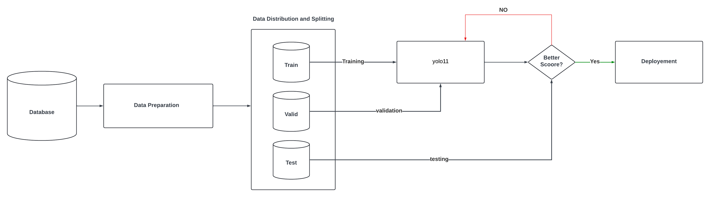

# Overview and Objectives
This project integrates drone technology with artificial intelligence (AI) to detect
diseases in tomato and pepper crops. The primary goal is to enhance agricultural
practices by providing early, accurate detection of diseases through high-resolution
drone imagery, processed using advanced AI algorithms. By leveraging dronebased
data collection and AI-based analysis, we aim to assist farmers in identifying
crop diseases early, ultimately contributing to increased yields and food security
# System Architecture AI
In this project, we utilize the YOLOv11 model, a state-of-the-art object detection
algorithm designed for real-time detection tasks. YOLOv11 is employed to
detect and localize diseased areas in images of tomato and pepper crops. The
model draws bounding boxes around the affected regions and classifies the detected
diseases into one of the predefined categories for each crop. This ensures
that both localization and classification are performed simultaneously, making it
an efficient solution for disease detection in agricultural contexts.

<!-- Resized image with width attribute -->

<!-- Add more resized screenshots with descriptions as needed -->

# System Architecture: Node Communication and Hardware Hierarchy
Each node operates independently but is interconnected through ROS2 topics,
enabling a modular, scalable system where real-time data is processed and acted
upon seamlessly. This architecture ensures that the drone can perform complex
tasks like navigating to specific waypoints, detecting and avoiding obstacles, and
interacting with its environment autonomously.

<!-- Resized image with width attribute -->

<!-- Add more resized screenshots with descriptions as needed -->

